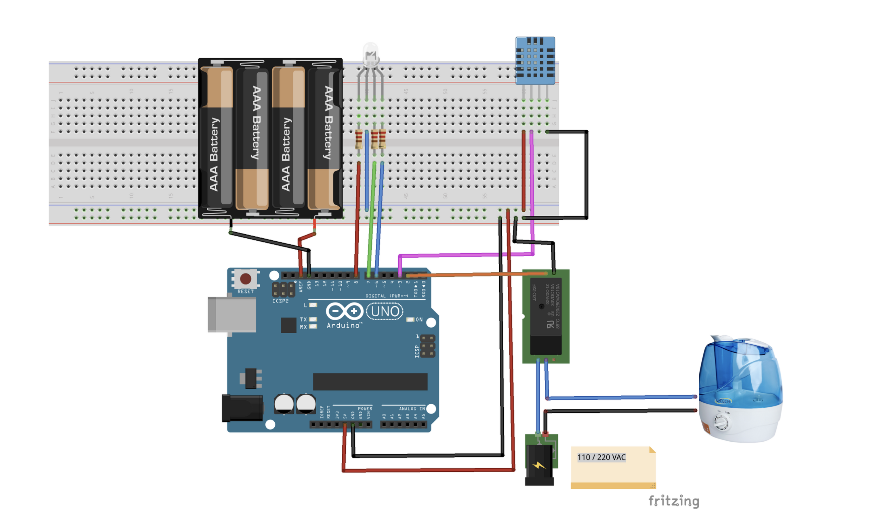

# ArduinoHumidifier
Project to activate humidifier device from the temperature and relative humidity of the air.

# Apresentation
[CANVAS](https://www.canva.com/design/DAD3wlA_JGk/d6Pr2IO1NJpFbZ4IaD4_vA/view?utm_content=DAD3wlA_JGk&utm_campaign=designshare&utm_medium=link&utm_source=sharebutton)

# Project Details 

Relay is active with pulse negative, in coding is `LOW`.
Led RGB is type cathodo.

# LED Indicator
* no warning, heat index is below to 27 graus celsius,  turn on ciano LED and relay off
* caution, heat index between 27 and 31 graus celsius, turn on blue LED and relay on
* extreme caution, heat index between 32 and 40 graus celsius, turn on purple LED and relay on
* extreme danger, heat index above 40 graus celsius, turn on red LED and relay on
